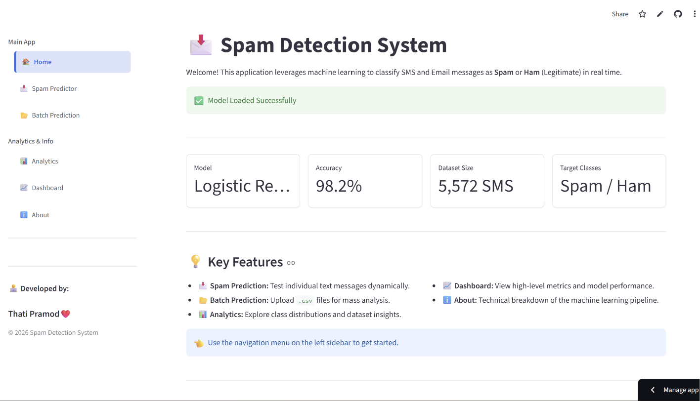
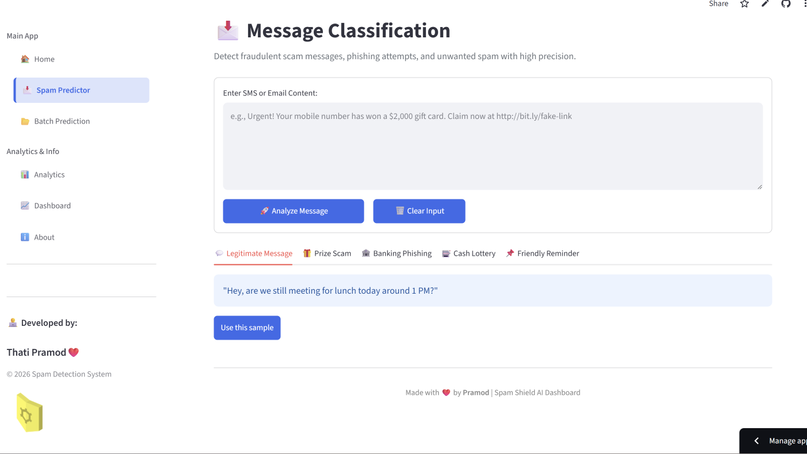
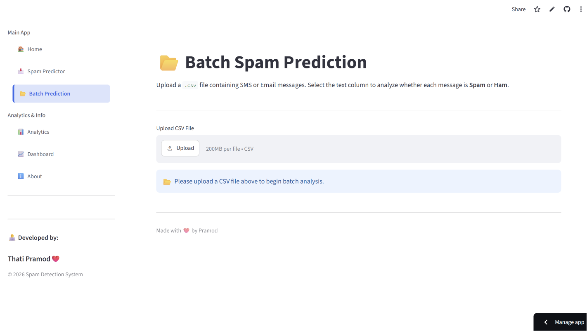

# 🛡️ Spam Detection ML

A modern **Machine Learning-based SMS Spam Detection System** built with **Python**, **Scikit-learn**, **NLTK**, and **Streamlit**. This application classifies SMS messages as **Spam** or **Ham (Not Spam)** using Natural Language Processing (NLP) techniques and supports both **single-message** and **batch predictions** through a clean web interface.


---

# 📌 Overview

Spam Detection ML is an end-to-end Machine Learning project that demonstrates how Natural Language Processing (NLP) can be used to automatically classify SMS messages.

The application includes:

- 📩 Real-time spam prediction
- 📂 Batch prediction using CSV files
- 📊 Interactive analytics
- 📈 Dashboard with visualizations
- 🤖 Machine Learning model trained using Logistic Regression
- ⚡ Fast and responsive Streamlit interface

---

# 🚀 Features

- ✅ Predict Spam or Ham instantly
- ✅ Upload CSV files for batch prediction
- ✅ Interactive analytics dashboard
- ✅ Dataset visualization
- ✅ Clean and responsive UI
- ✅ Lightweight and fast
- ✅ Easy to deploy using Streamlit Cloud

---

# 🖥️ Application Pages

- 🏠 Home
- 📩 Spam Predictor
- 📂 Batch Prediction
- 📊 Analytics
- 📈 Dashboard
- ℹ️ About

---

# 🧠 Machine Learning Pipeline

```
SMS Message
      │
      ▼
Text Cleaning
      │
      ▼
Tokenization
      │
      ▼
Stopword Removal
      │
      ▼
Stemming
      │
      ▼
TF-IDF Vectorization
      │
      ▼
Logistic Regression Model
      │
      ▼
Spam / Ham Prediction
```

---

# 🤖 Model Information

| Component | Technology |
|-----------|------------|
| Language | Python |
| Framework | Scikit-learn |
| NLP Library | NLTK |
| Vectorizer | TF-IDF |
| Algorithm | Logistic Regression |
| Frontend | Streamlit |
| Visualization | Matplotlib |

---

# 📊 Dataset

**SMS Spam Collection Dataset**

- Total Messages: **5,572**
- Ham Messages: **4,825**
- Spam Messages: **747**

Source:
https://archive.ics.uci.edu/ml/datasets/SMS+Spam+Collection

---

# 📈 Model Performance


| Metric | Score |
|---------|--------|
| Accuracy | 98% |
| Precision | 98% |
| Recall | 97% |
| F1-Score | 98% |

---

# 📂 Project Structure

```text
spam-detection-ml/
│
├── app.py
├── train_model.py
├── utils.py
├── requirements.txt
├── style.css
├── README.md
│
├── dataset/
│   └── spam.csv
│
├── models/
│   ├── spam_model.pkl
│   └── vectorizer.pkl
│
├── pages/
│   ├── About.py
│   ├── Analytics.py
│   ├── Batch_Prediction.py
│   ├── Dashboard.py
│   └── Spam_Predictor.py
│
├── screenshots/
│   ├── home.png
│   ├── spam_predictor.png
│   ├── batch_prediction.png
│   ├── analytics.png
│   └── dashboard.png
│
└── plots/
```

---

# 🛠️ Technologies Used

- Python
- Streamlit
- Pandas
- NumPy
- Scikit-learn
- Matplotlib
- NLTK

---

# 💡 Skills Demonstrated

- Machine Learning
- Natural Language Processing
- Text Classification
- Data Preprocessing
- TF-IDF Vectorization
- Logistic Regression
- Streamlit Development
- Data Visualization
- Python Programming
- Model Deployment

---

# ⚙️ Installation

## Clone the Repository

```bash
git clone https://github.com/Thatipramod/spam-detection-ml.git
```

Move into the project directory

```bash
cd spam-detection-ml
```

Install dependencies

```bash
pip install -r requirements.txt
```

Run the application

```bash
streamlit run app.py
```

---

# 📷 Screenshots

## 🏠 Home



---

## 📩 Spam Predictor



---

## 📂 Batch Prediction



---

## 📊 Analytics


---

## 📈 Dashboard


---

# 🎯 Motivation

The primary goal of this project is to demonstrate the practical implementation of Machine Learning and Natural Language Processing by building a real-world application capable of detecting spam SMS messages.

This project also showcases the deployment of an ML model using Streamlit with an intuitive and interactive user interface.

---

# 🔮 Future Improvements

- 📧 Email Spam Detection
- 🌍 Multi-language Support
- 🤖 Deep Learning (LSTM/BERT)
- ☁️ Cloud Database Integration
- 🔌 REST API
- 🐳 Docker Deployment
- 📱 Mobile-Friendly UI

---

# 🌐 Live Demo

**Streamlit Cloud**

https://spamguard.streamlit.app

*(Replace with your actual deployment link.)*

---

# 📁 GitHub Repository

https://github.com/Thatipramod/spam-detection-ml

---

# 👨‍💻 Author

**Thati Pramod**

GitHub:
https://github.com/Thatipramod

LinkedIn:
(Add your LinkedIn profile here)

---

# 📄 License

This project is licensed under the **MIT License**.

---

# ⭐ Support

If you found this project useful, please consider giving it a ⭐ on GitHub.

It helps others discover the project and motivates future improvements.

---
